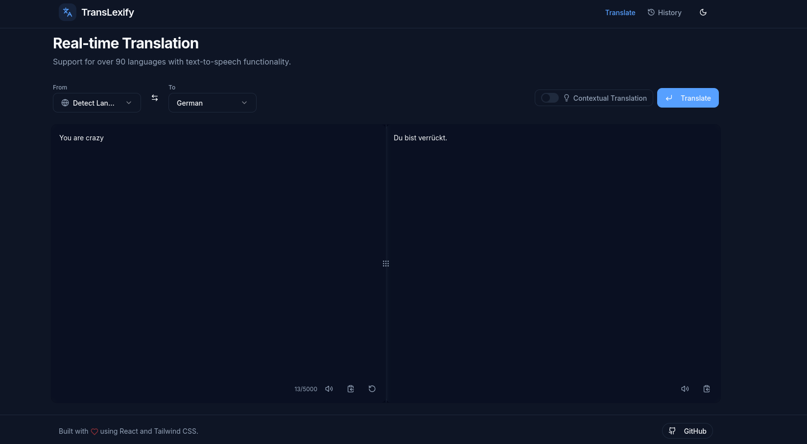
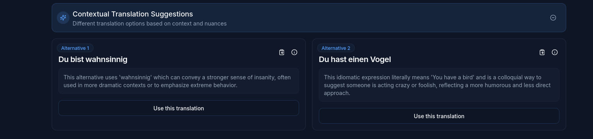

# TransLexify 🌍

A modern AI-powered translation tool that enables precise and context-aware translations across multiple languages.

[](https://github.com/Kenny1338/TransLexify)

## 📸 Screenshots

Here's a visual overview of TransLexify in action:


*Main translation interface*


*Advanced translation features*

## 🚀 Features

- 🤖 AI-powered translations using OpenAI
- 🔍 Automatic language detection built-in by default
- 🎭 Theme detection and domain-specific translations
- 🎯 Context-aware translations with alternative options
- 🎨 Tone adjustment (formal, informal, friendly, professional)
- 🗣️ High-quality text-to-speech with ElevenLabs
- 🌐 Support for multiple languages
- ✨ Modern, user-friendly interface
- ⚡ Real-time translation
- 📱 Responsive design

## 🛠️ Technology Stack

- **Frontend Framework**: React 18
- **Styling**: Tailwind CSS
- **UI Components**: shadcn/ui (Radix UI)
- **Bundler**: Vite
- **Language**: TypeScript
- **Routing**: React Router
- **Form Handling**: React Hook Form
- **Validation**: Zod
- **State Management**: React Query
- **Text-to-Speech**: ElevenLabs API & Web Speech API (fallback)

## 📋 Prerequisites

- Node.js (version 16 or higher)
- npm or yarn
- OpenAI API Key
- ElevenLabs API Key (optional, for enhanced TTS)

## 🚀 Installation

1. Clone the repository:
```bash
git clone git@github.com:Kenny1338/TransLexify.git
cd TransLexify
```

2. Install dependencies:
```bash
npm install
```

3. Configure environment variables:
   - Create a `.env` file in the root directory
   - Add your API keys:
```env
VITE_OPENAI_API_KEY=your_openai_api_key
VITE_ELEVENLABS_API_KEY=your_elevenlabs_api_key
```

4. Start the development server:
```bash
npm run dev
```

The application will be available at `http://localhost:8080`.

## 📦 Build

For a production build:
```bash
npm run build
```

For a development build:
```bash
npm run build:dev
```

## 🧪 Linting

Check code quality:
```bash
npm run lint
```

## 📁 Project Structure

```
TransLexify/
├── src/
│   ├── components/     # UI Components
│   ├── hooks/         # Custom React Hooks
│   ├── services/      # API Services
│   ├── styles/        # Global Styles
│   ├── types/         # TypeScript Definitions
│   └── utils/         # Helper Functions
├── public/            # Static Assets
└── ...
```

## 🌟 Advanced Features

### Automatic Language Detection
TransLexify automatically detects the language of your input text, making it easier to translate from any language without having to manually select the source language.

### Theme Detection
The application can identify the theme or domain of your text (technical, medical, legal, business, academic, literary, etc.) to provide more accurate, domain-specific translations.

### Tone Adjustment
Select from different tones for your translations:
- **Formal**: For official documents and professional settings
- **Informal**: For casual conversations and everyday use
- **Friendly**: Warm and welcoming language
- **Professional**: Business-appropriate language
- **Neutral**: Default balanced tone

### High-Quality Text-to-Speech
Powered by ElevenLabs' advanced text-to-speech technology, TransLexify offers natural-sounding voice output for your translations, with fallback to the browser's built-in speech synthesis when needed.

## 🤝 Contributing

Contributions are welcome! Please follow these steps:

1. Fork the repository
2. Create a feature branch (`git checkout -b feature/AmazingFeature`)
3. Commit your changes (`git commit -m 'Add some AmazingFeature'`)
4. Push to the branch (`git push origin feature/AmazingFeature`)
5. Open a Pull Request

## 📝 License

This project is licensed under the MIT License - see the [LICENSE](LICENSE) file for details.

## 🙏 Acknowledgments

- [React](https://reactjs.org/)
- [Vite](https://vitejs.dev/)
- [Tailwind CSS](https://tailwindcss.com/)
- [shadcn/ui](https://ui.shadcn.com/)
- [OpenAI](https://openai.com/)
- [ElevenLabs](https://elevenlabs.io/)